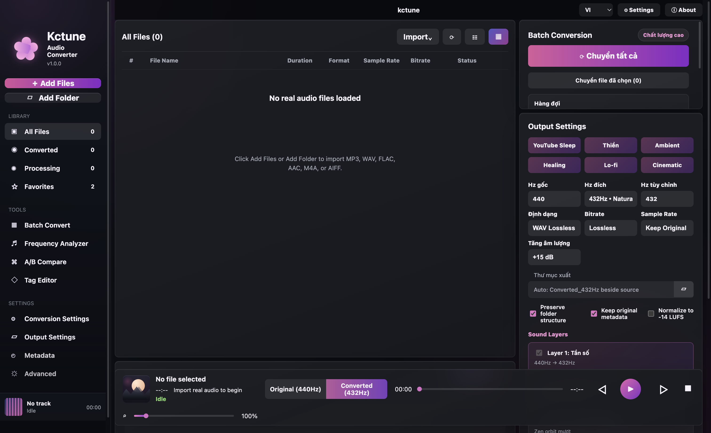

# kctune

kctune is a macOS desktop audio converter for ambient creators, meditation producers, healing-frequency users, and YouTube sleep-music workflows.

It focuses on fast batch retuning, 432Hz/528Hz style exports, 3D/8D spatial motion, A/B playback, real waveform comparison, metadata-aware import, and creator-friendly output settings.



## Highlights

- Drag and drop audio files or folders into the app.
- Import MP3, WAV, FLAC, AAC, M4A, AIFF, and AIF files.
- Batch convert selected files or the full library.
- Retune source frequency to target frequencies such as 432Hz, 528Hz, or custom values.
- Export WAV lossless by default, with MP3, FLAC, AAC, and AIFF options.
- Preserve metadata and artwork where supported by the output format.
- Preview original vs converted audio from the built-in player.
- Show real A/B waveform data loaded from the source and converted file.
- Add optional 528Hz drone, binaural layer, nature ambience, 3D space, and 8D motion.
- 8D mode adapts the stereo gain-orbit idea from Nikola Mircic's `8d-converter`.
- Auto Tune Pro pipeline: center-vocal extraction, pYIN pitch detection, snap-to-scale, frame pitch shift, and mix back.
- Output gain, bass/drum punch, and clean vocal-focused EQ controls.
- Vietnamese, English, and Chinese UI language support.
- BlackHole 2ch detection UI for future realtime system-audio routing.

## Screens

The current app is an Electron macOS desktop app with:

- left library/sidebar navigation
- file grid with converted-output details
- batch conversion panel
- output settings panel
- layer settings
- bottom playback bar
- A/B waveform comparison
- spectrum analyzer

## Requirements

- macOS on Apple Silicon
- Node.js
- FFmpeg and FFprobe
- Python 3 for Auto Tune Pro dependencies

Install FFmpeg with Homebrew:

```bash
brew install ffmpeg
```

## Install

```bash
npm install
```

## Run In Development

```bash
npm start
```

## Build macOS App

```bash
npm run build:mac
```

The app bundle is created at:

```text
release/kctune-darwin-arm64/kctune.app
```

To create a zip or dmg, use macOS packaging commands such as `ditto` and `hdiutil` after the build.

## Auto Tune Pro

Auto Tune Pro uses a Python worker at:

```text
scripts/autotune_pro.py
```

Dependencies are listed in:

```text
scripts/autotune_requirements.txt
```

The app creates or uses a local Python environment for the worker. The first Auto Tune Pro conversion can take longer because dependencies and analysis caches may need to initialize.

## 8D Audio

8D export is still a normal stereo audio file. The 8D effect comes from spatial DSP:

- stereo gain orbit
- frequency-aware movement
- bass kept near center
- mid/high motion
- light echo/space simulation
- limiter protection

Attribution and license notes are in:

```text
THIRD_PARTY_NOTICES.md
```

## Project Structure

```text
main.js                 Electron main process and audio pipeline
preload.js              Secure IPC bridge
renderer.js             UI state, player, drag-drop, waveform rendering
index.html              App layout
styles.css              Desktop UI styling
scripts/                Auto Tune Pro worker and requirements
assets/                 App icon files
THIRD_PARTY_NOTICES.md  Third-party attribution
```

## Notes

This project is actively evolving. Generated app bundles, venvs, audio outputs, and local test files are ignored by git.
